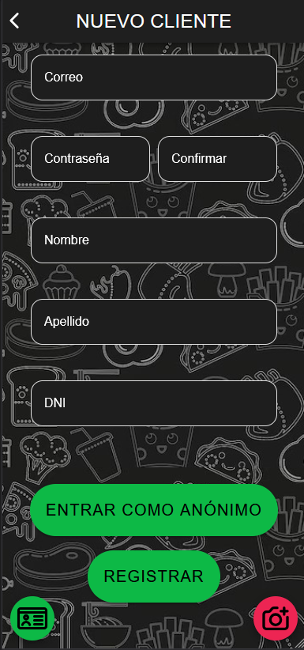
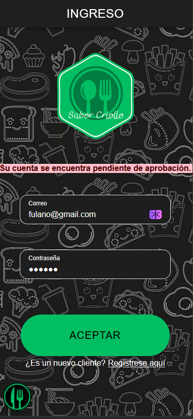
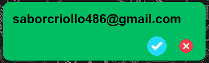

# 🍔 Sabor Criollo 2024

Bienvenido a **Sabor Criollo 2024**.

## 👥 Integrantes del grupo

- Alfa: Fausto Panello
- Beta: Joel Mahafud
- Gamma: Tomás Mastrapasqua

## 📅 Semana 1 (28/10 - 2/11)
    
### α Fausto Panello (Alfa)
    - ✔️ Creación del repositorio (28/10)
    - ✔️ Integración con Android (30/10)
    - ✔️ Creación del readme (28/10)
    - ⌛ Alta del cliente (Terminado la siguiente semana)

### β Joel Mahafud (Beta)
    - ✔️ Implementación firebase (28/10)
    - ✔️ Creación de la base de datos (1/11)
    - ✔️ Puesta en funcionamiento de servicio auth contra firebase auth y firestore (registro, login, logout, etc) (2/11)
    - ✔️ Alta dueño/supervisor (2/11)
    - ✔️ Alta de cuenta de correo para la empresa (2/11)

### γ Tomas Mastrapasqua (Gamma)
    - ✔️ Creación del proyecto (28/10)
    - ✔️ Splash screens (28/10)
    - ✔️ Diseño de ícono (28/10)
    - ✔️ login y formulario de ingreso con accesos rápidos (28/10)
    - ✔️ Alta empleados (2/11)

## 📅 Semana 2 (3/11 - 9/11)

### 📓 A Asignar

    -   ❌ Envio de mails
    -   ❌ Envio de Push Notifications

### α Fausto Panello (Alfa)
    - ✔️ (nueva) Función de escaneo de DNI (3/11)
    - ✔️ Alta del cliente (atrasado de la semana anterior). (6/11)
    
### β Joel Mahafud (Beta)
    - ✔️ Home reactivo a los perfiles de cada usuario (3/11)
    - ✔️ Fixes varios en módulos de alta (3/11)
    - ✔️ Fix error en compilación (9/11)
    - ✔️ Maquetado de menús (9/11)

### γ Tomas Mastrapasqua (Gamma)
    - ✔️ Módulo de gestión de aprobación de clientes (6/11)
    - ✔️ Lista de espera y asignacion de mesa de cliente/metre (7/11)
    - ✔️ Ver listado de productos y realizar pedido (9/11)
    - ✔️ Consulta al mozo (9/11)

## 📅 Semana 3 (10/11 - 16/11)

### 📓 A Asignar

    -   ❌ Envio de mails
    -   ❌ Envio de Push Notifications
    -   ❌ Alta de encuestas
    -   ❌ Pagar la cuenta y escaneo QR de descuentos

### α Fausto Panello (Alfa)
    - ✔️ Alta de encuestas (12/11)
    
### β Joel Mahafud (Beta)
    - ✔️ Unificado en estilos y lógica de los módulos de alta (11/11)
    - ✔️ Mejoras en mensajes de error y validaciones (13/11)
    - ✔️ Fixes varios, pulido en estilos, mejoras visuales. (14/11)
    - ✔️ Rediseño del componente pedido (15/11)
    - ✔️ 
    
### γ Tomas Mastrapasqua (Gamma)
    - ✔️ Bartender/Cocinero/Mozo visualizan sus tareas correspondientes (10/11)
    - ✔️ Graficos de torta y barra (10/11)
    - ✔️ Solicitar mesa y escaneo de la misma (validaciones) (10/11)
    - ⌛ Más tareas...

## 📅 Semana 4 (17/11 - 23/11)

### α Fausto Panello (Alfa)
    - ⌛ Más tareas...
    
### β Joel Mahafud (Beta)
    - ✔️ Fixes de UI (18/11)
    - ⌛ Más tareas...
    
### γ Tomas Mastrapasqua (Gamma)
    - ⌛ Más tareas...

## 📜 Módulos de funcionalidades mínimas a realizar

### 1 - Crear un cliente nuevo
    Tareas: Cargar todos sus datos personales y una foto
    Responsable: Fausto Panello
	

### 2 - Validar todos los campos
    Tareas: - Verificar la lectura del código QR del D.N.I. (varios formatos).
            - Verificar que el pre-registro se visualice en el listado de clientes pendientes de aprobación del dueño o supervisor (push notification *A)
            - Verificar que no se pueda ingresar a la aplicación sin ser aprobado. Informar lo acontecido con un mensaje alusivo.
	

### 3 - El dueño o supervisor (celular 3) acepta o rechaza al cliente.
    Tareas: - El cliente recibe un correo electrónico informado de la situación de su registro (uno por la aceptación y otro en el caso de rechazo). Los mensajes deben tener el logo de la empresa, mensajes personalizados, fuentes distintas a las que vienen por defecto, etc.
            - El correo electrónico debe ser automático y no se debe enviar con la cuenta personal de ninguno de los alumnos. (*B)
            - Verificar que el cliente NO pueda ingresar a la aplicación, si NO es aceptado (con estado ‘pendiente de aprobación’ o ‘rechazado’). Informar lo acontecido con un mensaje alusivo para cada caso.
            - Verificar que el cliente pueda ingresar a la aplicación, si es aceptado.

### 4 - Ingresa un cliente al local como anónimo (celular 2) y escanea el código QR para solicitar mesa (lista de espera).
    Tareas: - Verificar que aparezca en la lista de espera del maître (celular 1). (push notification *A)
            - Verificar que no puede tomar una mesa sin estar previamente en la lista de espera.
            - Verificar que solo puede acceder a los resultados de las encuestas previas.

### 5 - El maître procede a la asignación de una mesa.
    Tareas: - Verificar que el cliente no pueda vincularse con otra mesa (indicar que mesa debe ser).
            - El cliente escanea el código QR de la mesa asignada (celular 2).
            - Al tener la mesa asignada, se verifica que el cliente no se pueda vincular a otra mesa (indicar cuál es su mesa asignada).
            - Al tener la mesa asignada, se verifica que NO se le pueda asignar dicha mesa a otro cliente.

### 6 - Al cargar el código QR de la mesa (en el celular del cliente), se permite ver el listado de los productos (comidas, bebidas, postres) con tres imágenes por cada producto, precio, descripción y tiempo estimado de elaboración.
    Tareas: - Al tener la mesa asignada, se muestra el botón de “consulta al mozo”, que permite hacer una consulta rápida al mozo (con número de mesa, fecha con hora y minutos y la consulta
a ser realizada).
            - Verificar que le llegue a todos los mozos la consulta realizada. (push notification *A)
            - Un mozo responde la consulta con nombre, fecha con hora y minutos (celular 3). Se verifica en el cliente.

### 7 - El cliente procede a realizar el pedido para todos los comensales de la mesa.
    Tareas: - Verificar que en todo momento esté visible (y con buen tamaño) el importe acumulado.
            - Mostrar el tiempo estimado de realización del pedido (completo).
            - Verificar que el pedido no sea derivado a sus respectivos sectores hasta que el mozo no confirme el pedido.
            - El cliente vuelve a escanear el código QR de la mesa y podrá acceder al estado de su pedido.

### 8 - El mozo confirma el pedido (celular 3), este es derivado a los sectores correspondientes.
    Tareas: - Verificar que las distintas partes del pedido se visualicen en dichos sectores. (push notification *A)
            - El cliente vuelve a escanear el código QR de la mesa y podrá acceder a los juegos*, a la encuesta y al estado de su pedido.

### 9 - Cada sector (cocina y bar) realiza las tareas correspondientes (celular 1) y avisan que los productos están listos para que el mozo los entregue.
    Tareas: - Verificar que cada parte del pedido se visualice en el listado de pedidos pendientes del mozo. (push notification *A)
            - El cliente verifica el cambio de estado en su pedido (escaneando el QR de su mesa).

### 10 - El mozo entrega el pedido completo (las comidas, bebidas y postres).
    Tareas: - El cliente confirma la recepción de su pedido.
            - El cliente verifica el cambio de estado en su pedido (escaneando el QR de su mesa).
            - El cliente vuelve a escanear el código QR de la mesa y podrá acceder a los juegos*, a la encuesta y a la opción de ‘pedir la cuenta’.

### 11 - El cliente accede a la encuesta, en dónde ingresará su opinión sobre diversos temas.
    Tareas: - Verificar que sólo se pueda acceder una vez para poder agregar una encuesta nueva (una por estadía).
            - El cliente, escaneando el QR de su mesa, podrá visualizar los resultados de las encuestas en distintos tipos de gráficos (torta, barra, lineal, etc.).

### 12 - El cliente solicita la cuenta al mozo. (push notification *A)
    Tareas: - Se habilita, mediante la lectura del código QR correspondiente, el ingreso de la propina.
            - El detalle de la cuenta tendrá los pedidos realizados (con precios unitarios) con su respectivo importe, los descuentos correspondientes a los juegos* (sólo si gana en el primer intento), el grado de satisfacción del cliente (propina), y el TOTAL a abonar (grande y claro).
            - El cliente tendrá la posibilidad de realizar el pago (simulado) mediante una plataforma de pagos*.       

### 13 - El mozo confirma el pago y se libera la mesa.
    Tareas: - Verificar que la mesa esté libre nuevamente (haciendo que el cliente vuelva a escanear el QR de la mesa).
            - El cliente, escaneando el QR de la lista de espera, podrá visualizar los resultados de las encuestas en distintos tipos de gráficos (torta, barra, lineal, etc.).

---
